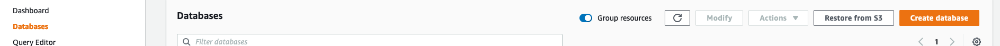
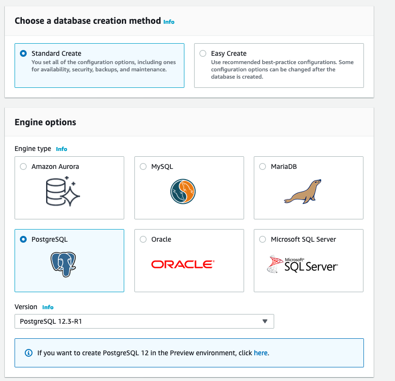
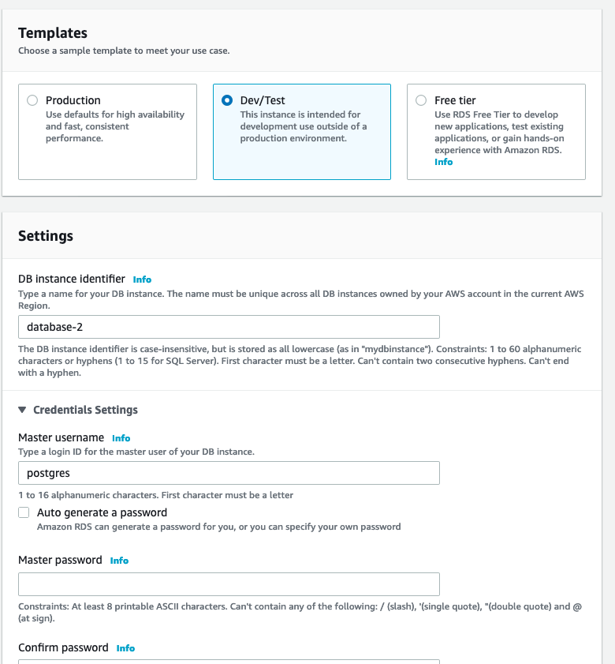
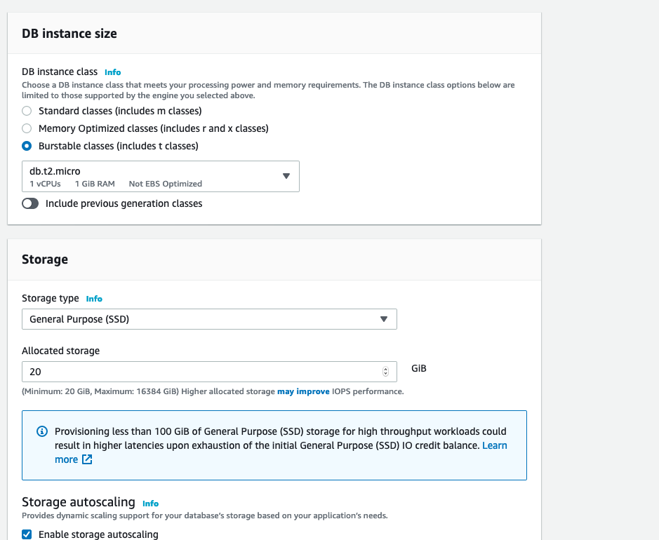
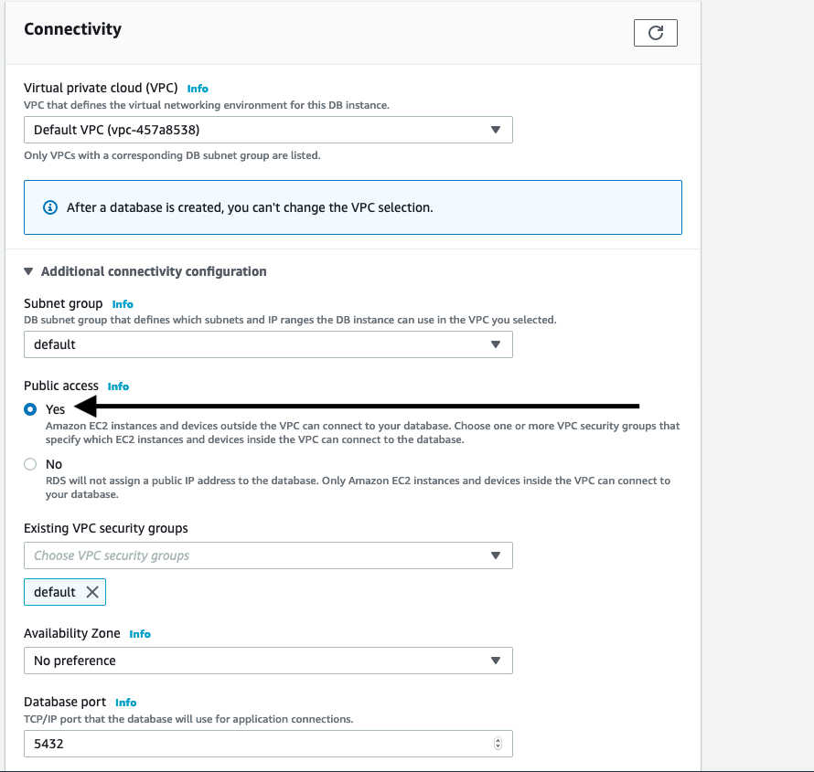
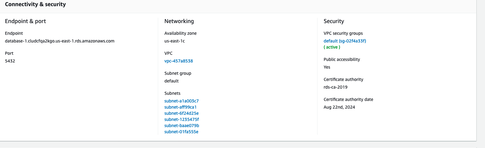

## Configuracion RDS

## Elegimos que tipo de base queremos

## Definimos el usuario y la master password de la base

## Cuidado con el tamaño de la instancia que elegimos, por el tema de costos. Se recomiendan las de tipo `t`, y tamaño `micro`

## Importante: si queremos acceder a la base desde fuera de la Nube Privada Virtual (VPC) necesitamos marcar Si aqui

## Tenemos nuestra base creada

