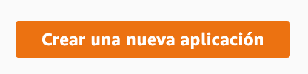
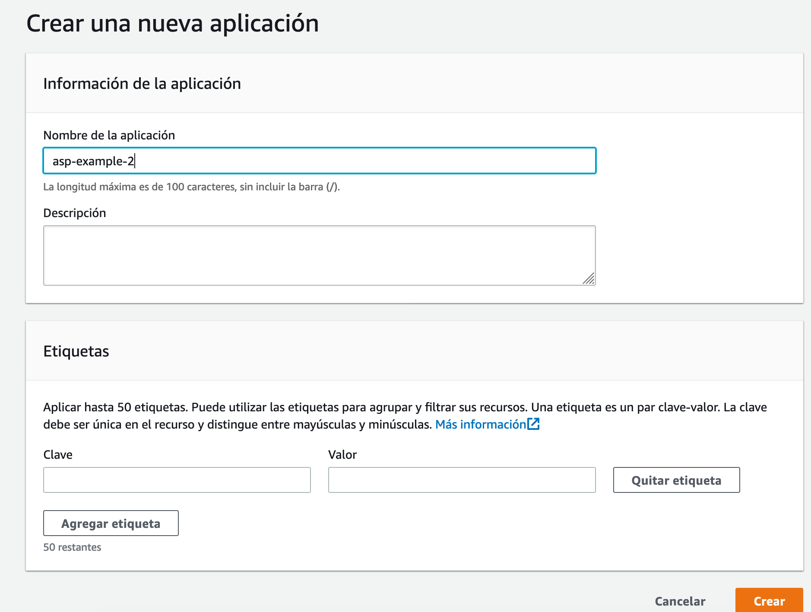
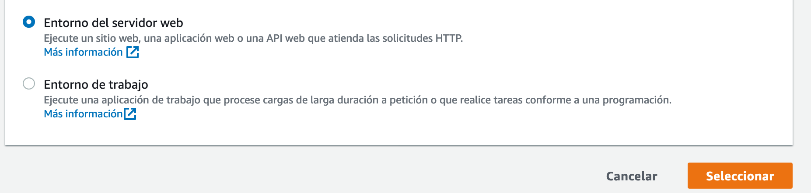
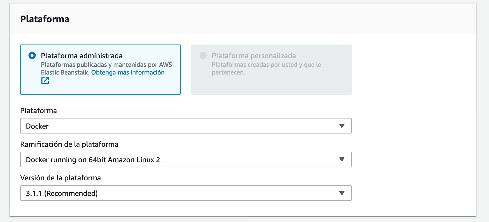
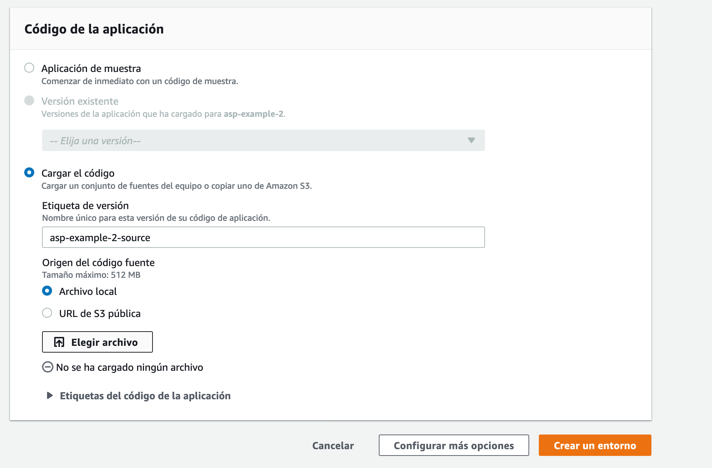
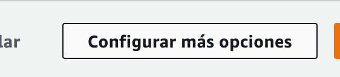
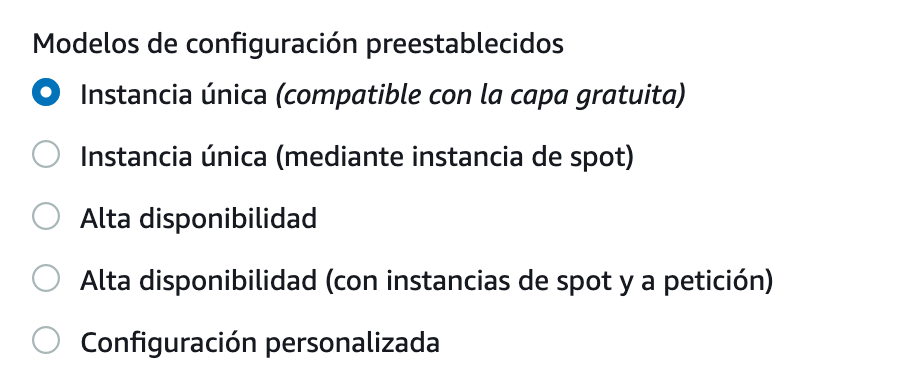
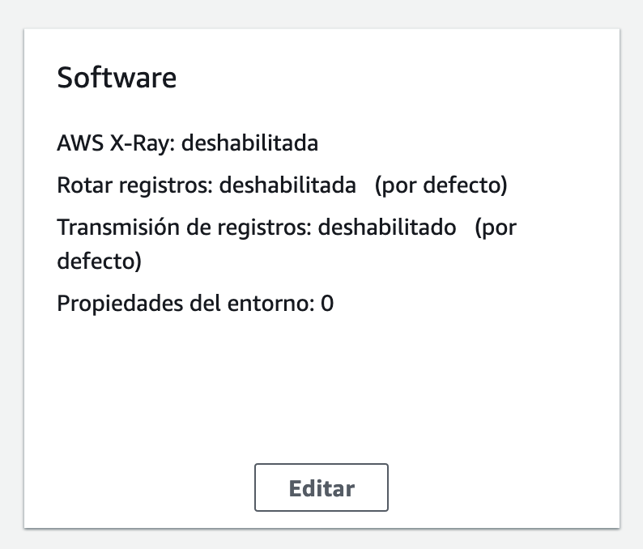
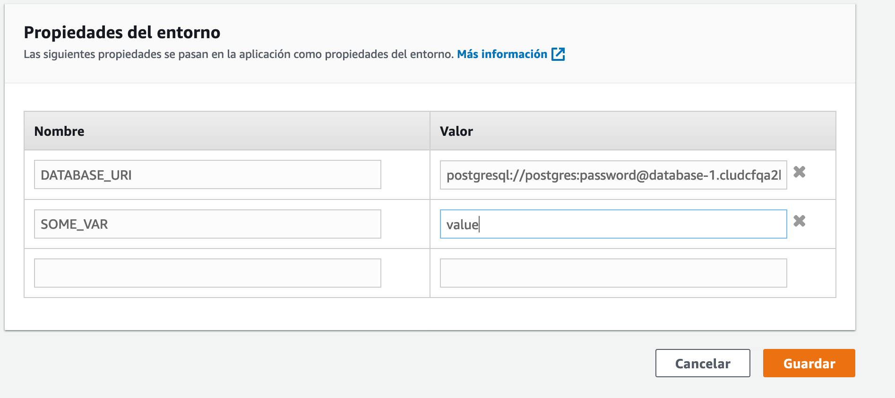

# AWS - Elastic Beanstalk

## AWS Educate
[Guia de registro](https://github.com/pablovilas/asp-course-examples/blob/master/2020/s2/s2c2/AWSEducate.md)

## Creacion de la base de datos:
[Creacion base RDS](RDS.md)

## Beanstalk

### Creando la aplicacion

### Creando el entorno 

**Elegimos que es un servidor web y que la plataforma va a ser Docker**

### Subimos el código de la aplicación, en un zip. Podria ser un bucket del servicio S3 como alternativa. 

### Clickeamos "Configurar mas opciones" IMPORTANTE

### Elegimos que use una sola instancia (por ahora)

### Clickeamos "Editar" en la caja de "Software"

### Aqui podemos cambiar las variables de entorno. Vamos a hablar de eso cuando demos 12 Factor. Importante para configurar aspectos y configuraciones de nuestra app.

### Creamos el entorno

