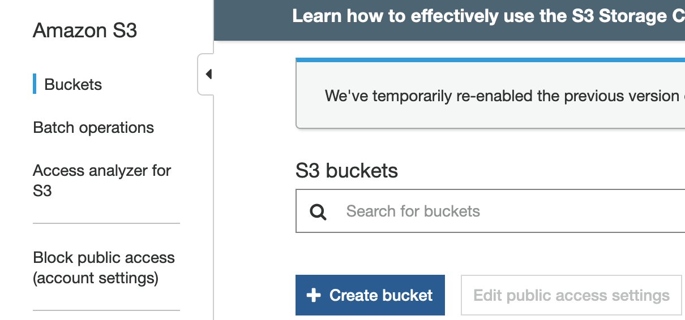
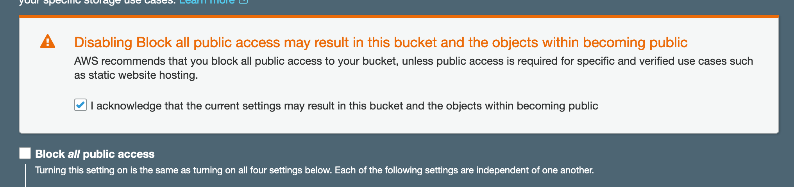
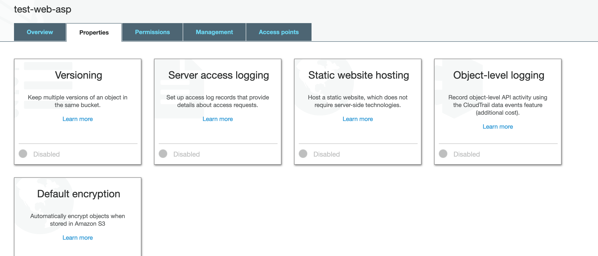
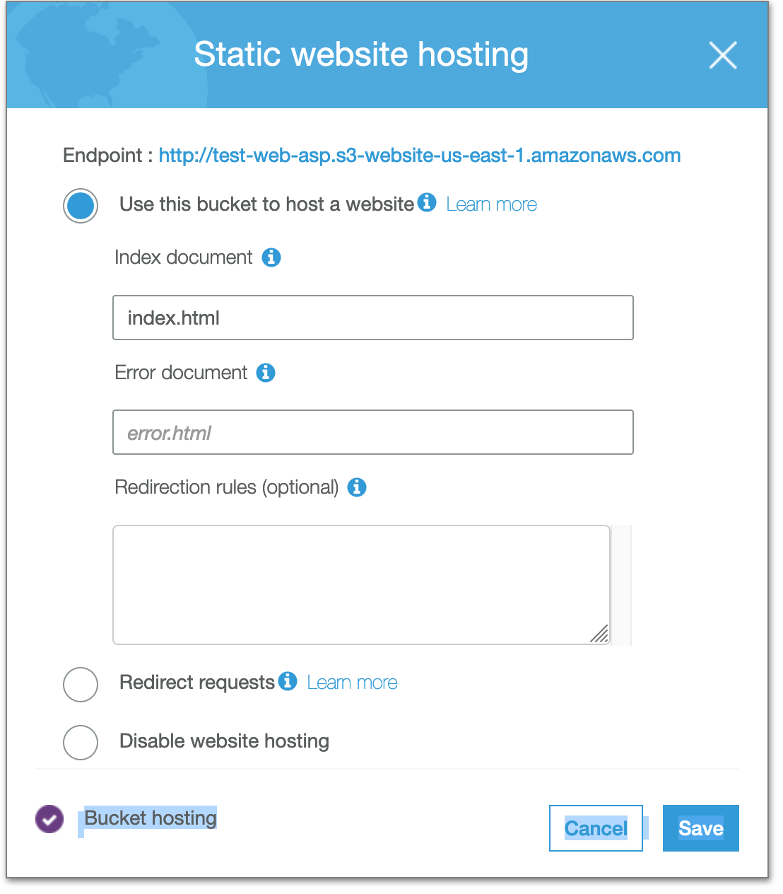
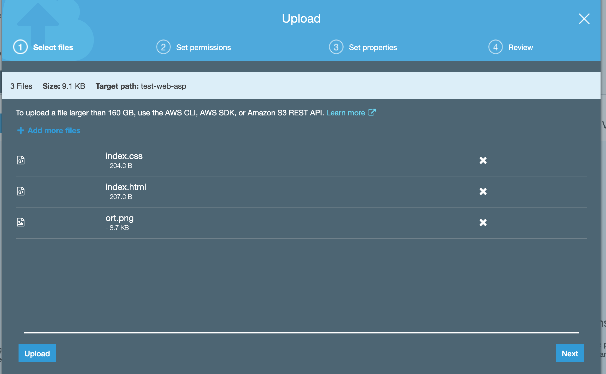
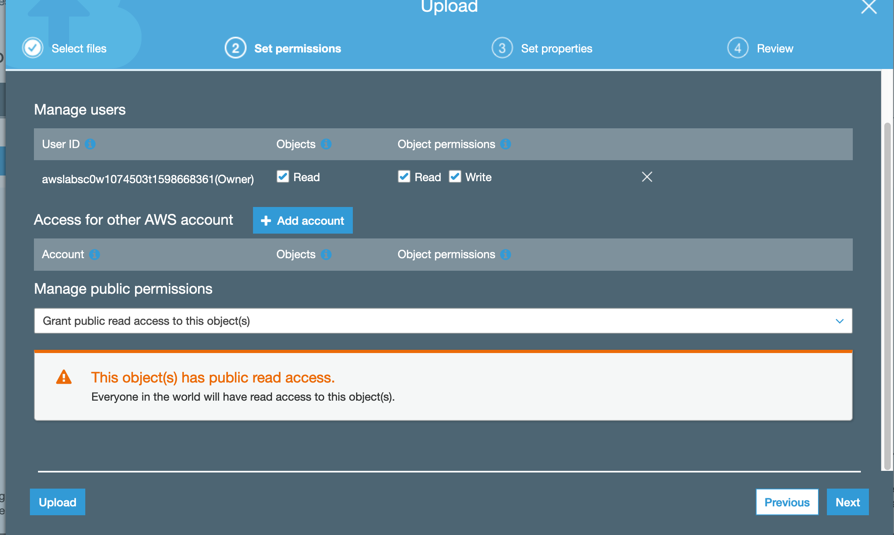
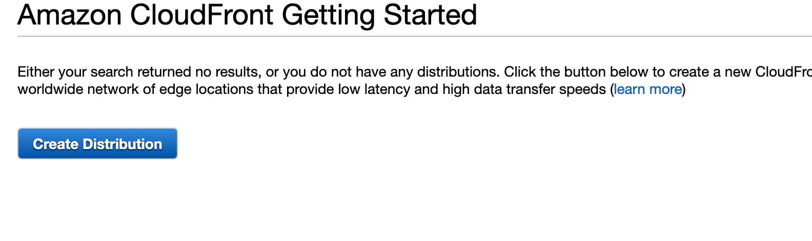
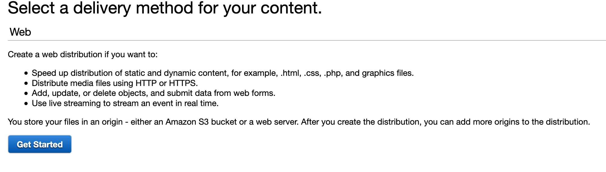
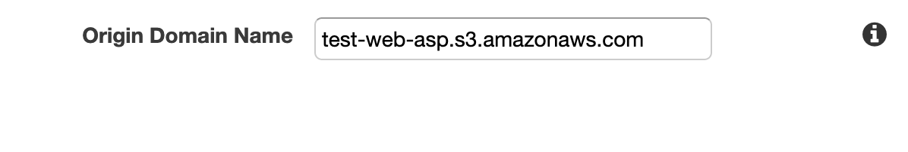

### Caching con CDN Cloudfront

#### Creamos el bucket de S3

#### Debe tener permisos para ser accedido publicamente ya que es una web
`

#### Una vez creado el bucket, vamos al mismo, y configuramos que sea una web

#### Subimos nuestros archivos, con permisos de ser accedidos publicamente

#### Creamos la distribucion de CloudFront

#### Tenemos nuestra distribucion creada, demorara un rato en crearse, y tendra una url como por ejemplo
`https://d1x55uk8dsnqot.cloudfront.net/index.html`

### Si queremos invalidar el cache, debemos crear una invalidacion:
https://docs.aws.amazon.com/AmazonCloudFront/latest/DeveloperGuide/Invalidation.html
